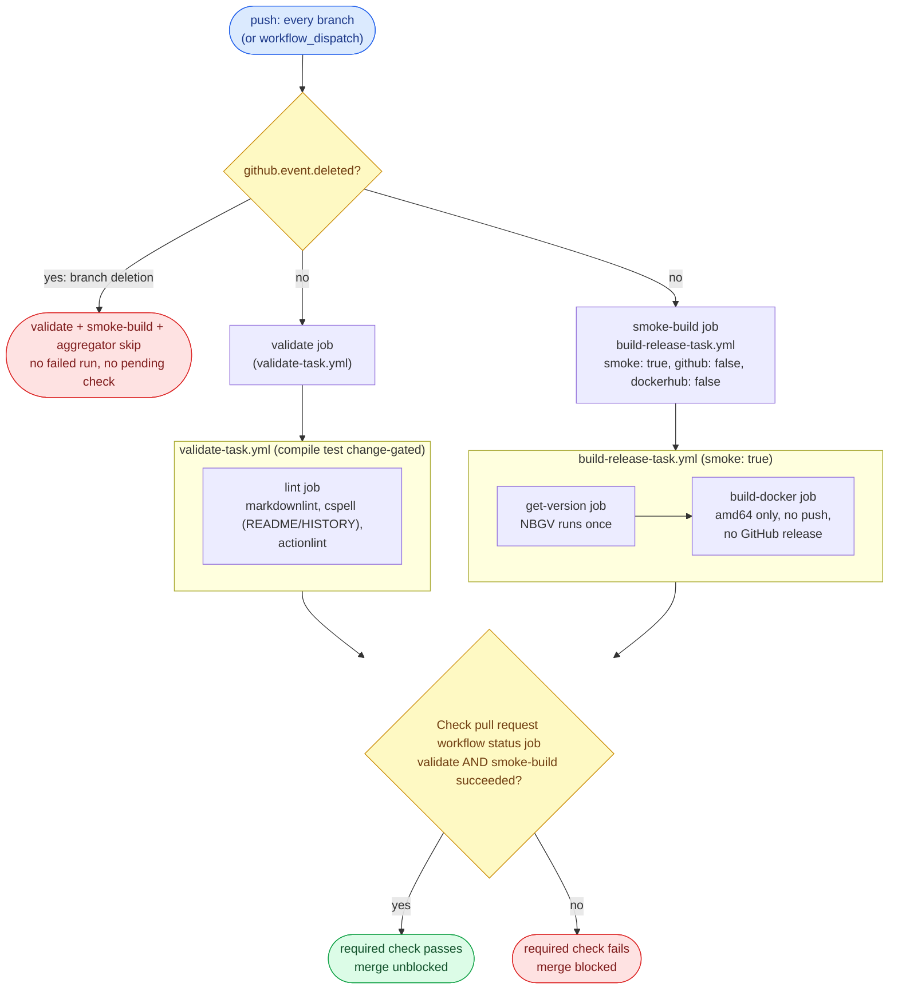
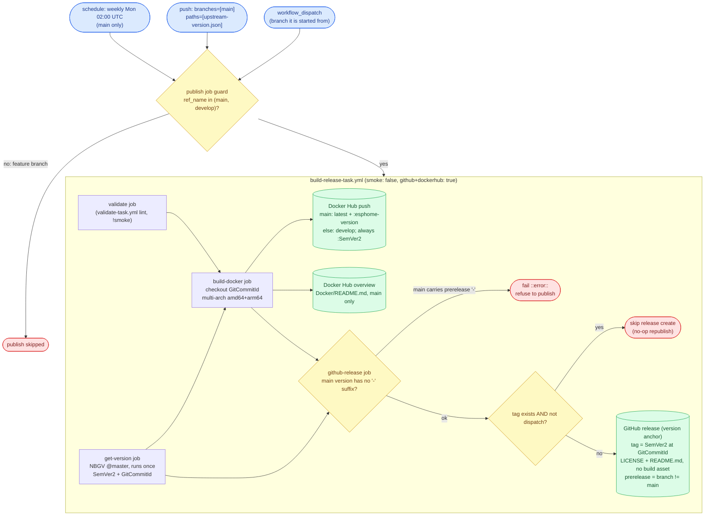
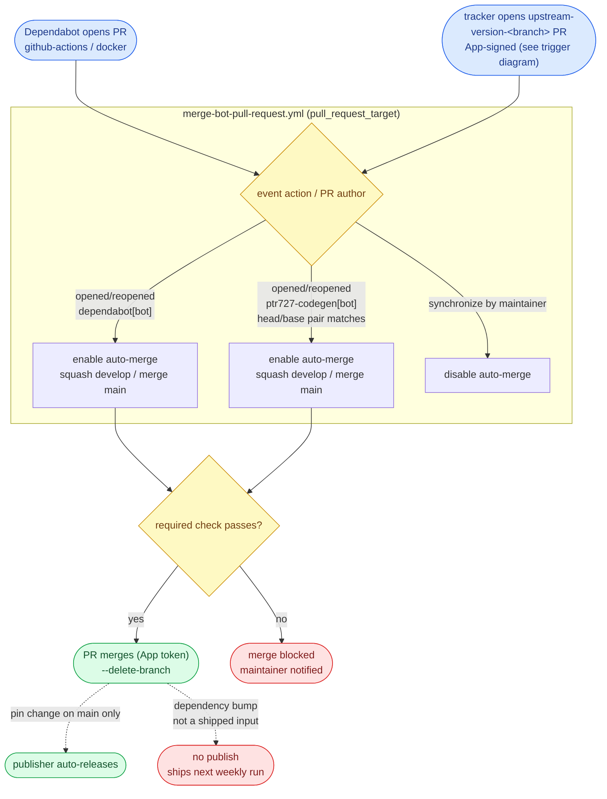
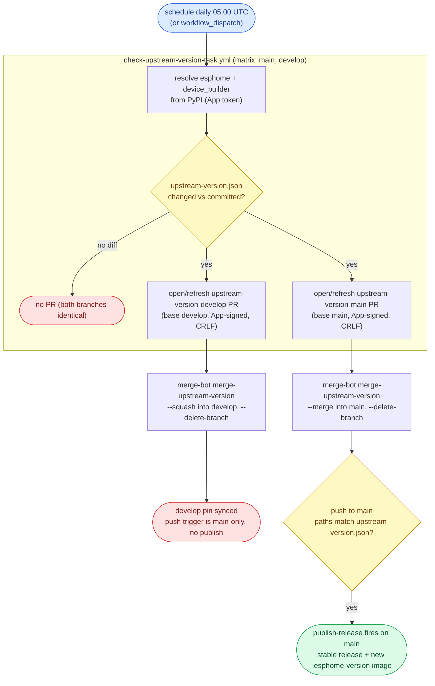

# WORKFLOW.md

The single guide for this repo's CI/CD **workflows** (GitHub Actions): **code style**, **architecture**, a
**behavioral contract** (expected inputs and outputs), and a **test methodology**. Source style lives in
[`CODESTYLE.md`](./CODESTYLE.md). This file covers everything under
[`.github/workflows/`](./.github/workflows/).

It **describes required outcomes, not a required implementation.** A workflow is correct when it satisfies
the contract (section 4), whatever shape its YAML takes. Section 2 keeps workflows legible. Section 3 is
the model. Section 4 is what they must *do*. Sections 5 and 6 are how to verify it and the configuration it
assumes. Each guarantee names the **failure it prevents**, so the reason survives a reimplementation.

## 0. The model at a glance

ESPHome-NonRoot ships **one target**: a **multi-arch Docker image** (Docker Hub `ptr727/esphome-nonroot`) that
layers a non-root [ESPHome](https://esphome.io/) plus the `esphome-device-builder` dashboard onto a
`python:3.14-slim` base. There is no compiled code in this repo - the Dockerfile is the only build input. The
shipped ESPHome and device-builder versions are pinned in `upstream-version.json`, a committed build input the
image reads at build time. Two workflows do the publishing work, plus a daily tracker that keeps the pin current:

- **CI** runs on **push to every branch**: it validates (lint) and smoke-builds the image, publishing nothing.
  A pull request merges only when its required check is green.
- **The publisher** is a **triggered-Docker** publisher. It runs on a **weekly schedule**, on **manual dispatch**,
  and on a **path-scoped push to `main` when `upstream-version.json` changes** - never on an ordinary merge, and
  it builds **one branch per run** (the trigger ref). The **schedule** rebuilds **`main` only** (stable release +
  refreshed `latest` image, picking up base-image CVEs). The **pin push** publishes `main` the moment the daily
  tracker commits a new upstream version - the pin push is scoped to `main` and gated to the tracker's own App
  identity, so a `develop` pin update is sync-only and a hand-edited pin does not release. A **dispatch**
  publishes the branch it is started from: from `main` -> stable / `latest`, from `develop` -> prerelease /
  `develop`. A single **plan job** owns that decision for the whole run.
- **The upstream-version tracker** runs **daily**: it resolves the latest `esphome` and `esphome-device-builder`
  PyPI releases and records them in `upstream-version.json` via an App-signed bump PR (dual-target `main` +
  `develop`), auto-merged by the merge-bot. The `main` bump's push is what fires the publisher.
- **The upstream-dependency watcher** runs **daily**: it snapshots the apt package list ESPHome's own base image
  installs into `upstream-dependency.json` and opens an App-signed PR against `develop` when the set moves. It is
  deliberately **not** auto-merged - which of upstream's packages this image needs is a judgment call.
- **The image compile test** is a job in the validation gate: it compiles checked-in configurations in the image as
  a non-root uid. The publisher always runs it, so a failure blocks the push and the release. Push CI runs it only
  when an inline change-gate sees the image or its test inputs move, so an upstream pin bump is compile-tested
  before it auto-merges while a doc-only push pays nothing.

There is no publish-on-merge of arbitrary code, no per-push release, and no two-branch matrix - building only the
trigger branch keeps `github.ref` aligned with the branch being versioned. Ordinary code merges accumulate and
ship in the next scheduled run; only the pin file change (or a schedule/dispatch) publishes. Dependabot pull
requests merge themselves once their checks pass.

### Glossary

- **Entry workflow** - has `push` / `schedule` / `workflow_dispatch` triggers. The orchestrator that an event or
  a person starts.
- **Reusable workflow (task)** - a `workflow_call` workflow invoked through a `uses:` reference, never
  triggered directly. File ends in `-task.yml`.
- **Target** - the one shipped output: the **Docker image** (`build-docker-task.yml`).
  `build-release-task.yml` orchestrates it plus the GitHub release.
- **Smoke build** - a CI build that builds the image to prove it still ships, publishing and pushing nothing.
  Driven by a `smoke: true` input.
- **Version-anchor release** - the GitHub release carries no build artifact: the image itself ships to Docker
  Hub. The release tags the built commit and attaches the in-tree `LICENSE` + `README.md`, so the tag is
  browsable and the version is recorded. *(There is no `release-asset` artifact seam - nothing is attached
  from a build job.)*
- **Pin / shipped input** - a file that changes what is shipped: `upstream-version.json` (the `esphome` +
  `device_builder` versions the image installs and tags), the Docker build context (`Dockerfile` and
  `entrypoint/`), or the version floor (`version.json`). GitHub-Actions and Docker base-image bumps are **not**
  shipped inputs - they ship in the next weekly publish, not on merge.
- **Upstream-version tracker** - the daily scheduled workflow that resolves the latest upstream PyPI versions and
  records them in `upstream-version.json` via an App-signed, auto-merged bump PR. The pin it writes is the
  shipped input the Docker build reads.
- **Upstream-dependency watcher** - the daily scheduled workflow that snapshots the apt package list from
  ESPHome's base image (`esphome/docker-base`, `debian/Dockerfile`, `base` stage) into `upstream-dependency.json`
  and opens a PR when it changes. The snapshot is a **review signal, not a shipped input**: nothing in the build
  reads it, and its head ref is outside the merge-bot's auto-merge pattern so a human triages it.
- **Image compile test** - the `compile-test` job in `validate-task.yml`, opt-in via the `compile-test` input. It
  loads the image locally and
  runs `esphome config` -> `esphome compile` inside it against the fixtures in `.github/compile-test/`, covering
  the distinct execution environments consumers use. Gates the Docker push, so a broken image never ships.
  Catches a missing *runtime* dependency, which a build-only smoke cannot see.
- **Release plan** - the `plan` job's decision, produced by `publish-plan-task.yml` from the event, actor, and
  ref: `publish` says whether this run releases at all, `stable` whether the target is `main`. Every gate reads
  these instead of re-testing the trigger, so the release policy lives in one place.
- **GitHub App token** - a short-lived installation token from `actions/create-github-app-token`, minted
  from the App credentials (`CODEGEN_APP_CLIENT_ID` / `CODEGEN_APP_PRIVATE_KEY`). The merge-bot and the tracker
  use it, not `GITHUB_TOKEN`: a `GITHUB_TOKEN` push does not trigger downstream workflows, and that token is
  read-only on Dependabot pull requests.

## 1. Purpose and how to use this document

- **Contract, not implementation.** Conform to the *outcomes* in section 4 and the *architecture* in section
  3. Job names and file layout may vary; the input/output behavior may not.
- **"Operational" - the one definition.** The repo is **operational** when every applicable section-4
  guarantee holds, every applicable section-5B scenario's observed output equals its expected output
  (corroborated by a 5C live probe where a live signal exists), and the section-6 configuration is in place.
  Anything else is **not operational**.
- **Defect vs N/A.** An item is **N/A** only when this repo has no such concern (e.g. a fork-PR scenario,
  since a fork cannot push here; or a build artifact, since nothing is attached to the release). A construct
  required by an applicable guarantee but absent is a **defect**.
- **Default branch is `main`.** Guarantees say "default branch" portably. This repo writes the literal `main`
  in the prerelease expression and the release-version backstop, the pin push's `branches: [main]` filter, and
  the anchored `^refs/heads/main$` in `version.json`'s `publicReleaseRefSpec`.

## 2. Workflow style conventions

Legibility rules. Necessary but not sufficient: a perfectly styled workflow can still violate section 4.

- **Action pinning.** Pin every action to a commit SHA with a trailing `# vX.Y.Z` comment. Use `# vX` only
  when the upstream floating major tag has no specific patch SHA. The **sole exception is `dotnet/nbgv@master`**
  (see D9.1). A tool an action *installs* (e.g. the actionlint binary behind `raven-actions/actionlint`) is not
  a `uses:` ref and is left unpinned to track latest.
- **Filename.** Reusable workflows end in `-task.yml`; entry workflows end in what they do
  (`-pull-request.yml`, `-release.yml`, `-version.yml`). A `-task.yml` is `uses:`-d, never triggered directly.
- **Workflow `name:`.** Reusable names end in **"task"**, entry names in **"action"**.
- **Job and step `name:`.** Every job `name:` ends in **"job"**, every step `name:` in **"step"**, the
  aggregator included (`Check pull request workflow status job`). A job name also bound as a ruleset
  required-check `context:` is codified in [`repo-config/`](./repo-config/) and changed only **in lockstep**
  with the live ruleset.
- **Concurrency.** Every entry workflow declares a `concurrency` group. CI uses
  `group: '${{ github.workflow }}-${{ github.ref }}'`, `cancel-in-progress: true`. The publisher overrides
  it: a ref-independent group with `cancel-in-progress: false`, so two publishes never overlap (a schedule, a
  pin push, and a manual dispatch, or back-to-back dispatches) and none is cancelled mid-release. The tracker
  uses a ref-independent group (`group: '${{ github.workflow }}'`) but with `cancel-in-progress: true`, distinct
  from the publisher's `false`: it only opens a pull request, so a later run superseding an in-flight one is
  safe.
- **Shells.** Every multi-line bash `run:` starts with `set -euo pipefail`.
- **Conditionals.** Multi-line `if:` uses the folded scalar `if: >-`.
- **Boolean inputs.** A boolean used by both `workflow_call` and `workflow_dispatch` is declared in both
  trigger blocks and compared against `true` and `'true'`.
- **Reusable-workflow permissions.** Job-level `permissions:` are validated before `if:`, so even a skipped
  job needs valid permissions. Grant least privilege; a callee's extra scope is granted by the caller.
- **Allowlist `success` and `skipped` explicitly** across an optional dependency: use
  `(needs.X.result == 'success' || needs.X.result == 'skipped')`, not `!= 'failure'`.
- **Line endings.** Workflow YAML follows [`.editorconfig`](./.editorconfig) (CRLF). Preserve on every edit.

## 3. Architecture

### Two workflows: CI on push, publishing on schedule/dispatch/pin-push

CI ([`test-pull-request.yml`](./.github/workflows/test-pull-request.yml)) and the publisher
([`publish-release.yml`](./.github/workflows/publish-release.yml)) are separate workflows with separate
concurrency, so they never race. CI re-tests every pushed tree and never publishes; the publisher releases
on its own cadence (schedule, pin push, dispatch) and never runs on an ordinary code merge. *Prevents a merge
from silently cutting a release, and a CI run from racing a publish on the same ref.*

### The publisher builds one branch: the trigger ref

A publish builds exactly **one** branch - the run's trigger ref. The **schedule** always runs on the default
branch, so it rebuilds `main`; the **pin push** is branch-filtered to `main`; a **dispatch** runs on the branch
it is started from (`main` or `develop`). The single `publish` job passes `github.ref_name` as both `ref` and
`branch`, so the branch built, versioned, and tagged is always the run's own ref. *No matrix and no cross-branch
ref mixing - `github.ref` is the branch being published.* The job is guarded to the long-lived branches (`main`
/ `develop`); a stray dispatch from a feature branch is a no-op. To release `develop`, dispatch the workflow
from `develop`.

Because the run's ref **is** the built branch, GitHub resolves the local `uses: ./...` reusable workflows from
that same branch's commit - so a `develop` dispatch runs develop's own task definitions, and the schedule runs
main's. There is no definition-vs-content split to reason about.

### The pin push: publishing the trigger, not the merge

The publisher's `push` trigger is scoped to `branches: [main]`, `paths: [upstream-version.json]`. Only a change
to the committed upstream pin on `main` publishes - and the only thing that changes that file is the daily
tracker's auto-merged bump PR. Ordinary code merges never touch the pin, so the "merges never publish" invariant
holds literally: a Dockerfile or docs change to `main` ships on the next weekly run or a manual dispatch, not on
its merge. The pin push fires `main`, so `github.ref` is `main` and NBGV classifies the release as public. The
develop pin update is sync-only (the push trigger is `main`-only), so develop never auto-publishes.

### The release gate: one plan job

Whether a run publishes is decided once, by the `plan` job calling
[`publish-plan-task.yml`](./.github/workflows/publish-plan-task.yml), and every other job reads that answer
rather than re-deriving it. The policy is therefore in one file instead of spread across job `if:` conditions
that can drift apart.

It publishes for a `schedule`, for a `workflow_dispatch` of `main` or `develop`, and for a `push` to `main`
made by the codegen App or Dependabot. The actor test is what distinguishes the tracker's auto-merged pin bump
from a person hand-editing the pin: the first is the release trigger, the second is an ordinary edit that ships
on the next scheduled run. Combined with the `main`-only push trigger, this is why a `develop` pin update is
sync-only and a human commit never releases by accident.

The outputs are the strings `'true'`/`'false'`, not booleans, so callers compare against `'true'` explicitly;
`if: ${{ needs.plan.outputs.publish }}` would pass unconditionally, since any non-empty string is truthy in an
Actions expression. The task is shared across repo types and also returns `stable`, which this repo has no use
for - `inputs.branch` already carries main-vs-develop through the build.

One consequence is worth naming: the actor allowlist is a hardcoded identity. If that identity ever changes,
the gate closes silently - pin pushes stop publishing, nothing errors, and the weekly schedule keeps releasing,
so the only symptom is upstream versions shipping up to a week late instead of same-day.

### Versioning: compute once, thread everywhere

NBGV runs once (in `get-version-task`), classifying from `github.ref` (see below), and its outputs (`SemVer2`,
`GitCommitId`) thread to every consumer via `outputs:` / `needs:`. The Docker build checks out a specific
commit to build it, but consumes the threaded version; it does **not** re-run NBGV. `main` (the public ref,
`publicReleaseRefSpec = ^refs/heads/main$`) builds a clean `X.Y.<height>`; every other branch a prerelease
`X.Y.<height>-g<sha>`. *Keeps the built image's version label and the release tag in agreement.* NBGV needs
only `version.json` and git history, so it works although the repo builds no .NET assembly. The NBGV `SemVer2`
is the `LABEL_VERSION` build-arg and the GitHub-release tag; it is independent of the `esphome` image tag, which
comes from `upstream-version.json`.

NBGV classifies `publicReleaseRefSpec` from the `GITHUB_REF` environment variable. Because the publisher builds
the **trigger ref** (one branch per run), `GITHUB_REF` already equals the branch being versioned - a schedule,
a pin push, or a `main` dispatch classifies as public (clean `X.Y.<height>`), a `develop` dispatch as prerelease
(`X.Y.<height>-g<sha>`) - so no `GITHUB_REF` override is needed. (`GITHUB_REF` is reserved and cannot be
reliably overridden anyway; the matrix publishers that build a non-trigger branch are the ones that need
`IGNORE_GITHUB_REF`.) The main-version backstop (D2.2) catches any misclassification.

### Validate at entry

A run that carries a cross-input invariant (e.g. `main` must not carry a prerelease suffix) asserts it once
with `::error::` before any publish. Downstream jobs `needs:` it.

### Fast CI feedback, head-resolved

CI runs on push to every branch, so GitHub head-resolves the reusable `./...` workflows from the pushed head:
a pull request that edits a reusable task tests its own copy. CI validates (the reusable `validate-task`:
`lint` only - there is no compiled code) and smoke-builds the image, pushing nothing. One aggregator job, the
ruleset-bound required check, gates the merge. A branch-deletion push (all-zeros `github.sha`) is skipped by a
`!github.event.deleted` guard on every job, so a deletion never runs a failing build. The publisher runs the
**same** `validate-task` against the branch it publishes (the run's ref is that branch), so the CI gate and the
publish gate are the identical definition applied to the same tree.

### The single-target release

`build-release-task` versions once, builds the Docker image, and creates the GitHub release. The Docker target
pushes multi-arch tags straight to Docker Hub: `latest` for main / `develop` for develop, the `:SemVer2`
release tag, plus on a `main` build the pinned `:<esphome version>` tag (from `upstream-version.json`). The
GitHub release is a **version anchor**: it tags the built commit and attaches the in-tree `LICENSE` +
`README.md` (no build artifact - the image ships to Docker Hub, not the release). The Docker Hub repository
overview (the in-tree [`Docker/README.md`](./Docker/README.md)) is pushed on a `main` Docker publish, since
Docker Hub does not read the GitHub README.

### Resource lifecycle

No job uploads or downloads a workflow artifact: the image ships to Docker Hub and the release attaches files
straight from the checkout. There is therefore no artifact retention or cleanup to manage. *(If a future
target adds a transfer artifact, it MUST set `retention-days: 1` and never blanket-delete the run's set.)*

### Self-sufficiency: automatic updates and upstream tracking

Every Dependabot pull request auto-merges once the required checks pass - any ecosystem and any tier,
semver-major included (this repo's ecosystems are `github-actions` + `docker`). The required checks are the
safety net, not the version bump. A merged Actions/base-image bump does not itself publish - it ships in the
next weekly publish. This repo **does** run an upstream-version tracker (it tracks the `esphome` and
`device_builder` PyPI releases) - unlike the pure-Docker siblings, which have neither codegen nor a tracker. A
person steps in only for a breaking change (a red check) or to dispatch a release.

### The upstream-version tracker

[`check-upstream-version.yml`](./.github/workflows/check-upstream-version.yml) runs daily (and on dispatch). It
resolves the latest `esphome` and `esphome-device-builder` versions from PyPI and calls the reusable
[`check-upstream-version-task.yml`](./.github/workflows/check-upstream-version-task.yml), which matrixes over
`main` and `develop`: each leg rewrites `upstream-version.json` (sorted keys, CRLF) and opens an App-signed
rolling bump PR on `upstream-version-<branch>`. The merge-bot's `merge-upstream-version` job auto-merges each
(squash to develop, merge-commit to main). The `main` merge is a push that touches the pin -> the publisher's
path-scoped trigger fires and ships the new upstream version. Both matrix legs resolve the same PyPI versions,
so the committed state is byte-identical on both branches and a `develop -> main` promotion never conflicts on
the pin. *This is the one ESPHome-specific contract the pure-Docker siblings lack: a 100%-certain "update
required" signal that publishes the new upstream within ~a day, not just on the weekly base-image refresh.*

### The upstream-dependency watcher

[`check-upstream-dependency.yml`](./.github/workflows/check-upstream-dependency.yml) runs daily (and on
dispatch). It reads the apt package list from the `base` stage of `esphome/docker-base`'s `debian/Dockerfile`,
records the sorted names in `upstream-dependency.json` (CRLF), and opens an App-signed PR on
`upstream-dependency-develop` when the set moves. Names only: upstream pins `name=version`, so keeping versions
would turn every Debian point release into a diff.

Two properties are deliberate. The head ref does **not** match the merge-bot's `upstream-version-*` pattern, so
the PR waits for a person - upstream ships a single-stage runtime image and this one splits builder from final,
so a package upstream adds may belong in either stage or neither. And the file is not a shipped input: no build
step reads it, so committing it never fires the publisher's pin-push trigger. Merging the PR records the new
snapshot and closes the signal, so any Dockerfile change it implies belongs in that same PR.

### The image compile test

The `compile-test` job in [`validate-task.yml`](./.github/workflows/validate-task.yml) builds the commit being
validated (amd64, loaded locally, cache read-only, never pushed) and runs `esphome compile` inside it as uid
1000. It sits beside `lint` because validation is where tests belong: lint is the source-level gate, and this is
the artifact-level one. It differs from lint in needing a built image, which is why it is opt-in through the
`compile-test` input rather than always on. `build-docker` already needs `validate`, so a firmware break blocks
the push and the release with no extra wiring.

It is deliberately neither a standalone daily job nor part of push CI. The image only changes when a build
fires - a weekly rebuild, a pin push, or a dispatch - so testing on that trigger covers every distinct image
while a blind daily schedule would mostly recompile yesterday's bits. The tracker's daily pin bump is what makes the
upper bound roughly once a day. Push CI leaves it off because ~5 minutes on every push is a poor trade for a
class of break that cannot reach users without a publish.

It exists because a build-only smoke cannot see this class of break: ESPHome downloads its toolchains on first
compile, and those binaries link against system libraries, so a missing runtime package surfaces only when a
compile actually runs. Each fixture in `.github/compile-test/` is validated with `esphome config` and only then
compiled, so a configuration break and a toolchain break give distinct signals, and the non-root uid asserts
the property this image exists to provide.

The fixtures are chosen to span the *execution environments* a consumer hits, not to enumerate boards - each
adds a dimension the others cannot reach:

| Fixture | Dimension it covers |
| --- | --- |
| `esp32-bluetooth-proxy.yaml` | Xtensa ESP-IDF, and the widest component surface (BLE stack) |
| `esp32c6-bluetooth-proxy.yaml` | RISC-V ESP-IDF - a separate compiler binary, not just another board |
| `esp32-ethernet.yaml` | wired Ethernet PHY drivers, which the wifi configurations never compile |
| `esp8266-d1-mini.yaml` | PlatformIO + Arduino - a different build system, not a different target |

They are hand-authored and checked in, each naming the upstream ESPHome project it is modeled on
(`esphome/bluetooth-proxies`, `esphome/ready-made-project-template`) so a refresh has a reference point.
Neither fetching those projects at run time nor generating configurations from `esphome wizard` is used: both
couple a daily monitor to something outside this repo that can change under it, and a scheduled job whose
common failure is its own breakage stops being believed. Checked-in fixtures rot too - an ESPHome schema
change fails `esphome config` - but that rot is loud, obvious, and a one-line fix. Detecting upstream drift is
the dependency watcher's job, not this one's.

### Flow diagrams

Four diagrams trace the architecture above: the pull-request gate, the self-publisher, the bot
automation, and the upstream-version trigger chain. They depict the same outcomes that the section 4 contract specifies,
drawn from the workflow YAML; if a diagram and a guarantee disagree, one of them is a defect. Triggers
are blue, gates yellow, durable/published outputs green, and stop/skip outcomes red.

**Pull request (CI) - `test-pull-request.yml`.** Every push (all branches, not tags) head-resolves the
reusable tasks, runs the lint-only validate gate and a non-publishing amd64 smoke build, and a single
aggregator produces the ruleset-bound required check (D1, D6).

**Publish - `publish-release.yml` -> `build-release-task.yml`.** A weekly schedule (main only), a
path-scoped pin push to main, or a dispatch runs the lint validate gate, versions once with NBGV,
asserts main-vs-version, builds the pinned commit multi-arch, pushes the Docker tags to Docker Hub,
and cuts the version-anchor GitHub release (D0, D2, D3, D4).

**Automation - Dependabot + tracker + merge-bot.** Dependabot and the daily upstream-version tracker
open in-repo bot PRs; the merge-bot enables auto-merge (or disables it on a maintainer push); a merged
pin change then drives the publisher above, while a merged dependency bump does not (D8).

**Upstream-version trigger chain - `check-upstream-version.yml` -> publisher.** The daily tracker
resolves the PyPI versions, rewrites the pin per branch, opens auto-merged bump PRs; merging the main
bump is the pin push that fires the publisher, shipping the new upstream within about a day (D8.3, D4.1).

## 4. Behavioral contract - expected outcomes

Each is a **MUST**, stated as input -> output plus the failure it prevents.

### D0 - Architecture

- **D0.1 CI is one run, one branch.** Input: any push. Output: `test-pull-request` builds/validates exactly
  `github.ref_name` and publishes nothing. *Prevents cross-branch ref mixing in CI.*
- **D0.2 The publisher builds one branch: the trigger ref.** Output: the `publish` job passes
  `github.ref_name` as `ref` and `branch`, so it checks out, versions, and tags exactly the run's own branch
  (the schedule's / pin push's default branch, or a dispatch's branch). No matrix; the job is guarded to
  `main`/`develop`. *Prevents cross-branch ref mixing - `github.ref` is the branch being published.*
- **D0.3 One version, threaded.** Output: NBGV runs once, every consumer reads it via `needs:` outputs; no
  consumer recomputes it. *Allowed:* checking out a specific commit to build it, and recording the built
  commit as the release `target_commitish`. *Prevents the image's version diverging from its tag, and a second
  NBGV run reclassifying the `:SemVer2` tag.*

### D1 - CI fast feedback

- **D1.1 Every push validates and smoke-builds the image; the compile test is change-gated.** Output: on any
  push, the `validate` job (the reusable `validate-task`) and `smoke-build` (the Docker target through
  `build-release-task` with `smoke: true`) run, no paths filter. The inline `changes` job sets `validate`'s
  `compile-test` input, true when `Docker/**`, `.github/compile-test/**`, or `upstream-version.json` moved, and
  true whenever the diff is unusable (new branch, force-push, dispatch). A feature branch is diffed against its
  merge-base with `develop`, not against the push, so a later docs-only commit cannot retire the compile test
  the branch's own image change earned; `main` and `develop` are diffed by push, which is what catches the
  change after a squash-merge.
  *Prevents a reusable-workflow or build break shipping untested, without charging every doc push ~5 minutes.*
- **D1.2 Smoke builds the image.** Output: `smoke-build` builds the Docker image (amd64 only, seeded from the
  branch-scoped cache) to prove it still builds. There is no source-level unit test (nothing compiles here); the
  artifact-level `compile-test` job exists but stays off on push CI (D11.1).
- **D1.3 Lint enforces the editor checks in CI.** Output: `validate-task`'s `lint` job runs `markdownlint-cli2`,
  `cspell` on the user-facing docs (README, HISTORY), and `actionlint` (which shellchecks every `run:`). Same
  checks the editor runs. There is no CSharpier / `dotnet format` step and no Python lint - nothing compiles
  here (the Python lives only inside the Dockerfile, exercised by the smoke build).
- **D1.4 Smoke never publishes and never pushes.** Output: a smoke build builds the image but makes no GitHub
  release, no Docker push, no Docker Hub overview update. Every publish step is gated `!smoke`.
- **D1.5 One required aggregator gates merge.** Output: a single aggregator job must **succeed** (not merely
  "not fail"), `needs:` `validate` and `smoke-build`, and blocks on any non-success. Its name is
  ruleset-bound (D6.2) and must not be renamed. *Prevents a defect merging unverified.*

### D2 - Validation at entry

- **D2.1 Validate before publishing.** Output: a dedicated job/step asserts each cross-input invariant and
  fails fast with `::error::` before a publish; downstream jobs `needs:` it.
- **D2.2 Main matches version classification.** Input: a real (non-smoke) publish run for `main`. Output: the
  release fails loudly if `main` carries a prerelease suffix. It strips `+buildmetadata` before testing for
  the prerelease `-`. Skipped on smoke. *Prevents a develop build published as the stable `latest`.*

### D3 - Versioning and classification

- **D3.1 NBGV runs once, threaded.** Output: NBGV runs once, classifying from the checked-out branch; no
  consumer re-invokes it. The run builds the trigger ref, so `GITHUB_REF` already matches the branch being
  versioned and NBGV classifies it correctly (no override needed).
- **D3.2 `main` = stable, others = prerelease.** Output: `main` -> `X.Y.<height>`, any other branch ->
  `X.Y.<height>-g<sha>`. The release-version backstop and the GitHub-release `prerelease` expression name `main`;
  `publicReleaseRefSpec` is `^refs/heads/main$`.
- **D3.3 Version floor + git height.** Output: `version.json` sets the major.minor floor, NBGV appends the
  git height as the patch, never bumped on a cadence. The NBGV version drives the GitHub-release tag and the
  `LABEL_VERSION` build-arg; the image's `esphome` tag is independent (from `upstream-version.json`). *(Who
  raises the floor and when is a human-process rule in `AGENTS.md`.)*

### D4 - Release / publish

- **D4.1 Publish only on schedule, pin push, or dispatch - never on an ordinary merge.** Output:
  `publish-release` triggers are `schedule` (weekly), `workflow_dispatch`, and a path-scoped `push`
  (`branches: [main]`, `paths: [upstream-version.json]`) only. There is **no `PUBLISH_ON_MERGE` variable** and
  no broad `push` trigger. An ordinary code merge does not touch the pin, so it does not publish. The `publish`
  job gates on the plan job's decision (D4.9), so a stray dispatch from a feature branch is a no-op.
  *Prevents per-merge release churn while still publishing a new upstream version the moment the tracker lands
  it on `main`.*
- **D4.2 A publish builds the one trigger branch in full.** Output: the run builds the Docker image and
  creates the GitHub release for `github.ref_name` - the schedule and the pin push rebuild `main` (stable /
  `latest`); a dispatch publishes its own branch (`main` stable / `latest`, `develop` prerelease / `develop`).
  *Prevents a half-published release and cross-branch ref mixing.*
- **D4.3 Tag the built commit.** Output: the release `target_commitish` is the run's `GitCommitId` (the tip of
  `github.ref_name`), never a moving branch ref. *Prevents the tag landing on the wrong commit.*
- **D4.4 Release contents and flag.** Output: each release is a tag on the built commit (a version anchor)
  plus the auto-generated notes and the in-tree `LICENSE` + `README.md`. **`fail_on_unmatched_files` is omitted
  (left off):** the Docker-only target ships no `release-asset-*` artifact, so the asset glob legitimately
  matches zero files; turning it on would red a clean Docker-only release. (This is the per-repo divergence
  from the executable-target sibling, which sets it `true` *because* it must upload a binary.) The GitHub-release
  `prerelease` boolean is `inputs.branch != 'main'`. No build artifact is attached; the image pushes
  `latest`/`develop` + `:SemVer2` + (on main) the pinned `:<esphome version>` multi-arch tags to Docker Hub.
- **D4.5 No-op republish.** Input: a weekly re-run whose version is unchanged (no new commits). Output: the
  release-create step is skipped when the tag already exists (refreshed only on `workflow_dispatch`), while
  the Docker push still runs - re-pushing the same tags refreshes the base image. *Prevents duplicate releases
  while still refreshing the image.*
- **D4.6 Publish is tested as built.** Output: the publish runs `validate-task` against the branch it publishes
  (inside `build-release-task`, gated `!smoke`) before building, so a failing lint blocks the release. The run's
  ref **is** the published branch, so the reusable-task definitions resolve from that branch - it is the
  identical definition CI runs on the same tree. *Prevents publishing a tree that would fail the lint gate.*
- **D4.7 Docker publishing authenticates with Docker Hub credentials.** Output: the Docker target logs in via
  `docker/login-action` with `DOCKER_HUB_USERNAME` + `DOCKER_HUB_ACCESS_TOKEN` (on every build, including
  smoke, for higher pull/cache rate limits) and pushes with `docker/build-push-action`; the Docker Hub overview
  is pushed with the same token. There is no NuGet/OIDC publishing in this repo. *Prevents a missing-credential
  publish or cache-read failure.*
- **D4.8 Branch-scoped Docker buildcache.** Output: the Docker build reads both branches' registry caches
  (`buildcache-main`, `buildcache-develop`) and writes only its own branch's cache, only when pushing, so a
  `main` and a `develop` publish never overwrite each other's cache. *Prevents one branch's publish destroying
  the other's cache hit-rate.*

- **D4.9 One plan job owns the release-gate decision.** Output: `publish-release`'s `plan` job calls
  [`publish-plan-task.yml`](./.github/workflows/publish-plan-task.yml) with the event, actor, and ref, and the
  `publish` job gates on `needs.plan.outputs.publish == 'true'` instead of re-testing those in its own `if:`.
  The task returns `publish: true` for a `schedule`, for a `workflow_dispatch` of `main`/`develop`, and for a
  `push` to `main` by the codegen App or Dependabot; a hand-edited pin and a feature-branch dispatch both
  resolve to `false`. Its outputs are the **strings** `'true'`/`'false'`, so a caller must compare explicitly -
  a bare `if: ${{ needs.plan.outputs.publish }}` is always truthy, because a non-empty string is truthy in an
  Actions expression. The task also exposes `stable`, which this repo does not consume (main-only behavior is
  already carried by `inputs.branch`); an output a given caller leaves unused is expected of a task shared
  across repo types and is not a D9.5 violation. *Prevents the gate drifting between scattered job conditions,
  and keeps a hand-edited pin from publishing.*

### D5 - Resource cleanup

- **D5.1 No transfer artifacts.** No job uploads or downloads a workflow artifact: the image ships to Docker
  Hub and the release attaches `LICENSE` + `README.md` straight from the checkout. There is nothing to retain
  or clean up. *(N/A unless a future target adds an artifact, which MUST then set `retention-days: 1` and
  never blanket-delete the run's set.)*

### D6 - Self-testing workflows

- **D6.1 A change is testable on its own branch.** Output: a workflow or build change is exercised by CI on
  the branch that introduces it, no dependency on reaching `main` first.
- **D6.2 Head-resolution, single producer, fork exception.** Output: CI runs on `push` to every branch so
  reusable `./...` logic resolves from the head, and the aggregator's ruleset-bound `context:` is produced by
  that push run as the sole producer of that name. Dependabot and tracker PRs are in-repo branches, validated
  the same way. A fork cannot push, so it has no run and is validated by maintainer action - the one exception.
  *Prevents a dual-producer context race and a false self-test claim for forks.*

### D7 - Concurrency, permissions, safety

- **D7.1 The publisher does not cancel mid-flight.** Output: ref-independent group, `cancel-in-progress:
  false`. CI uses the `...-${{ github.ref }}` group with `cancel-in-progress: true`; the merge-bot keys on PR
  number (D8.1); the tracker uses a ref-independent group with `cancel-in-progress: true` (distinct from the
  publisher's `false`), safe because it only opens a pull request.
- **D7.2 Skipped jobs still need valid permissions.** Output: every reusable job runs under valid least-privilege
  `permissions:`; a callee's extra scope is granted by the caller.
- **D7.3 Boolean inputs both forms.** Declared in both trigger blocks, compared against `true` and `'true'`.

### D8 - Bots and automation

- **D8.1 Merge-bot.** Output: runs on `pull_request_target`, holds the App token, merges the PR by URL without
  checking out its code, with `--delete-branch`. Enables auto-merge on `opened`/`reopened`; squash on `develop`,
  merge-commit on `main` by the PR's base ref; disables auto-merge when a maintainer pushes to a bot branch.
  Concurrency keyed on PR number.
- **D8.2 Dependabot auto-merges on green, every tier.** Output: every Dependabot PR - any ecosystem,
  semver-major included - auto-merges once the required checks pass, with no version-tier exception (this
  repo's ecosystems are `github-actions` + `docker`). A failing check blocks the merge. A merged bump does **not**
  itself publish (dependencies are not shipped inputs); it ships in the next weekly publish.
- **D8.3 Upstream-version tracker.** Output: the tracker runs daily, resolves the upstream PyPI versions, and
  opens an App-signed dual-target (`main` + `develop`) bump PR rewriting `upstream-version.json`; the merge-bot's
  `merge-upstream-version` job auto-merges and deletes its head. The `main` bump's push fires the publisher's
  pin-push trigger. This repo has a tracker but no codegen (`run-codegen-*`); the merge-bot carries
  `merge-dependabot` + `merge-upstream-version` + `disable-auto-merge-on-maintainer-push`, not `merge-codegen`.
  *Prevents a new upstream release going unshipped until the weekly run.*
- **D8.4 Upstream-dependency watcher.** Output: the watcher runs daily, snapshots the `base`-stage apt package
  names from `esphome/docker-base` into `upstream-dependency.json` (sorted, CRLF, names only), and opens an
  App-signed PR on `upstream-dependency-develop` when the set moves. Its head ref is outside the merge-bot's
  `upstream-version-*` pattern, so it does **not** auto-merge; the file is not a shipped input, so committing it
  does not fire the publisher. *Prevents an upstream runtime dependency being noticed only through a user bug
  report.*

### D9 - Style, static, and dropped workflows (see section 2)

- **D9.1** Every action SHA-pinned with a version comment (sole exception: `dotnet/nbgv@master`). `nbgv`'s tag
  stream lags `master`, so Dependabot tag-tracking would only propose downgrades to stale tags; the rationale
  is documented inline in `get-version-task.yml`. An installed-tool version (e.g. the actionlint binary) is
  left unpinned to track latest.
- **D9.2** File/workflow/job/step names follow the suffix rules; a ruleset-bound `context:` name moves only in
  lockstep with `repo-config/`.
- **D9.3** Bash `run:` blocks start `set -euo pipefail`; multi-line `if:` uses `>-`.
- **D9.4** Line endings follow `.editorconfig`. `upstream-version.json` stays CRLF (the tracker writes it CRLF
  via `sed 's/$/\r/'`).
- **D9.5 No decorative / dropped workflows.** No date-badge (`build-datebadge-*`), no tool-versions task, no
  separate docker-readme task, no executable/`build-executable-task`, no `PUBLISH_ON_MERGE` variable, no
  `dorny/paths-filter`. Their presence is a defect to remove. The `check-upstream-version*` tracker and the
  merge-bot's `merge-upstream-version` job are **kept** - this repo uses them (the documented exception to
  "drop unused merge-bot jobs").
- **D9.6** Style is enforced in CI by the `lint` job (D1.3), from the same config files the editor uses.

### D10 - Repository configuration

- **D10.1 Required configuration is present.** Output: the secrets, branch rulesets, and repository settings
  section 6 lists are all in place. The detail and validation are in section 6; the audit is 5D.

### D11 - Runtime image verification

- **D11.1 The image compiles firmware before it ships.** Output: `validate-task`'s `compile-test` job runs when
  the caller sets `compile-test: true` - the publisher always does, push CI when its change-gate fires (D1.1);
  it builds the validated commit (amd64, `load: true`, `push: false`, cache read-only) and runs `esphome compile`
  inside it, and `build-docker` needs `validate`. *Prevents a runtime dependency missing from the final stage
  reaching Docker Hub - invisible to a build-only smoke, because the toolchains that link against it are
  downloaded on first compile.*
- **D11.2 Configurations are checked in and validated before compiling.** Output: each fixture lives in
  `.github/compile-test/`, is hand-authored rather than fetched or generated at run time, names the upstream
  project it is modeled on, and passes `esphome config` before `esphome compile` runs. *Prevents a daily
  monitor failing on someone else's change, and separates a configuration break from a toolchain break.*
- **D11.3 Every execution environment, non-root.** Output: the fixtures cover Xtensa ESP-IDF, RISC-V ESP-IDF,
  wired Ethernet, and PlatformIO/Arduino, and the container runs as uid 1000. *Prevents a break confined to one
  toolchain, build system, or network stack - or a root-only regression - passing as green.*

## 5. Test methodology

### 5A. Static audit (no execution)

Read the workflow files plus `version.json` and `upstream-version.json` and assert the fact behind each
applicable guarantee with a `file:line` citation:

- **D0:** CI has no branch matrix; the publisher's single `publish` job passes `github.ref_name` as
  `ref`/`branch` and is guarded to `main`/`develop`; NBGV invoked once, every other consumer reads it via
  `needs:` (no nested `get-version` in `build-docker-task`); the run builds the trigger ref so `GITHUB_REF`
  matches the versioned branch.
- **D1:** CI runs on `push` with no paths filter; `validate` + `smoke-build` (the Docker target, `smoke: true`)
  run; `lint` runs markdownlint, cspell on README/HISTORY, actionlint; the inline `changes` job sets
  `compile-test` from the merge-base diff on a feature branch and the push diff on `main`/`develop`, failing
  open on an unusable diff; there is no source-level unit-test,
  CSharpier/`dotnet format`, or Python-lint step; the aggregator `needs:` all three (a `changes` failure blocks)
  and blocks on non-success.
- **D2:** the main release backstop checks the prerelease `-`, strips `+buildmetadata`, self-skips on smoke.
- **D3:** `main` appears in the backstop and the `prerelease` expression; `publicReleaseRefSpec` is
  `^refs/heads/main$`; the esphome tag reads `upstream-version.json`, the `:SemVer2` tag reads the threaded NBGV.
- **D4:** `publish-release` triggers are `schedule` + `workflow_dispatch` + path-scoped `push`
  (`branches: [main]`, `paths: [upstream-version.json]`) only (no broad `push`, no `PUBLISH_ON_MERGE`); the
  single `publish` job gates on `needs.plan.outputs.publish == 'true'` (compared as a string) and passes
  `github.ref_name` as `ref`/`branch`; the `plan` job threads `github.event_name`/`actor`/`ref_name` into
  `publish-plan-task`;
  `target_commitish` is `GitCommitId`; the `prerelease` boolean `== (inputs.branch != 'main')`; the release
  attaches `LICENSE` + `README.md` with **no `fail_on_unmatched_files`** and no build artifact; the Docker job
  logs in with `DOCKER_HUB_*` and pushes `latest`/`develop` + `:SemVer2` (+ main `:<esphome>`); release-create
  gated `exists == false || workflow_dispatch`; Docker buildcache is branch-scoped and write-gated on push; the
  Docker Hub overview push is gated to `main`.
- **D5:** no `upload-artifact` / `download-artifact` producing a transfer artifact; no blanket artifact delete.
- **D6:** CI is `push` on every branch; the aggregator context has exactly one producer; no
  `pull_request`-triggered fallback.
- **D7:** the publisher group is ref-independent with `cancel-in-progress: false`; the merge-bot keys on PR
  number; the tracker group is ref-independent; CI uses the standard group; reusable jobs declare permissions.
- **D8/D9:** the merge-bot runs on `pull_request_target` with the App token, keyed on PR number, merges with
  `--delete-branch`, and carries `merge-upstream-version`; Dependabot auto-merge has no semver-major
  exception; the tracker is daily, App-signed, dual-target; the dependency watcher is daily, App-signed, targets
  `develop` on a head ref the merge-bot does not match, and writes a file no build step reads; no codegen,
  date-badge, tool-versions, docker-readme task, executable task, `PUBLISH_ON_MERGE`, or `dorny/paths-filter`;
  actions SHA-pinned except `dotnet/nbgv@master`; names/shells/conditionals per section 2.
- **D11:** `validate-task` declares the `compile-test` boolean input defaulting false; the publisher passes true
  and `test-pull-request` passes its change-gate result; the job is gated on it, builds with `load: true` / `push: false` and no
  `cache-to`, compiles the checked-in `.github/compile-test/` fixtures with `esphome config` run before
  `esphome compile`, covers Xtensa ESP-IDF + RISC-V ESP-IDF + Ethernet + PlatformIO, fetches no configuration at
  run time, and runs the container `--user 1000:1000`. Both callers pass `secrets: inherit`, without which the
  job's Docker Hub login fails and the gate cannot run.

### 5B. End-to-end trace scenarios (deterministic from the YAML)

| # | Input | Expected output | Exercises |
| --- | --- | --- | --- |
| S1 | push touching `Dockerfile` | `validate` (change-gate fires, so lint **and** compile test) + `smoke-build` run; the image builds, **no push, no release**; aggregator success | D0.1, D1, D11.1 |
| S2 | push changing only docs on a branch that changed nothing else | the change-gate sets `compile-test=false`; `validate` runs lint only + `smoke-build` runs; nothing publishes | D1, D1.1, D1.5 |
| S2a | docs-only push on a branch that earlier changed `Docker/**` | the merge-base diff still sees the image change, so `compile-test` stays true and the branch cannot pass ungated | D1.1 |
| S3 | push changing only `.github/workflows/**` | `smoke-build` exercises the changed reusable workflow head-resolved; `lint` runs actionlint; compile test stays off (no image input moved); aggregator success | D1.1, D6.1 |
| S4 | weekly `schedule` | builds + publishes `main` only: stable release + refreshed `latest` + `:SemVer2` + `:<esphome>` (multi-arch); `target_commitish` = main's SHA; develop is not touched | D4.1, D4.2, D4.4 |
| S5 | tracker merges a new pin to `main` | the path-scoped pin push fires the publisher on `main`: stable release + refreshed image with the new `:<esphome>` tag | D4.1, D8.3 |
| S6 | `workflow_dispatch` from `develop` | builds + publishes `develop`: prerelease `X.Y.<height>-g<sha>` + `develop` image; `github.ref` is develop, so NBGV classifies it non-public | D4.1, D4.2, D3.2 |
| S7 | `workflow_dispatch` re-run, no new commits | release-create refreshed on dispatch (or skipped if the tag exists on schedule); Docker re-pushed (base refresh); no duplicate release | D4.5 |
| S8 | `workflow_dispatch` from a feature branch | the `publish` job's `github.ref_name in (main, develop)` guard skips it -> no publish | D4.1 |
| S9 | merged GitHub-Actions or base-image bump | not a pin change and merges don't publish -> **no release**; ships in the next scheduled run | D4.1, D8.2 |
| S10 | PR with a markdown / spelling / workflow-YAML violation | the `lint` job fails -> aggregator blocks the merge | D1.3, D1.5 |
| S11 | `version.json` floor bump merged | not a pin change, merges don't publish -> no immediate release; the new floor ships in the next publish | D3.3, D4.1 |
| S12 | `develop` -> `main` promotion (merge commit) | the merge itself does not publish (it does not change the pin); `main`'s accumulated changes ship in the next scheduled run | D4.1, D8.1 |
| S13 | upstream adds an apt package to its base image | the watcher opens a PR against `develop` naming the added package; it does **not** auto-merge and does **not** publish | D8.4 |
| S14 | a runtime library the toolchain links against is dropped from the Dockerfile | push CI stays green; the next publish's compile test fails on the ESP-IDF fixtures and nothing is pushed | D11.1, D11.3 |
| S15 | an ESPHome release changes a schema a fixture uses | `esphome config` fails before `esphome compile`, naming the fixture to update | D11.2 |
| S16 | a runtime dependency is missing for RISC-V but not Xtensa | the Xtensa fixtures pass and `esp32c6-bluetooth-proxy.yaml` fails, isolating it to that toolchain | D11.3 |
| S17 | the tracker opens an upstream pin bump PR that breaks compiles | the change-gate sees `upstream-version.json`, the compile test runs and fails, the required check blocks auto-merge before the pin reaches `main` | D1.1, D8.3, D11.1 |
| S18 | the tracker's pin bump auto-merges to `main` | the plan job sees a push to `main` by the App identity -> `publish=true`; `main` publishes the new upstream version same-day | D4.1, D4.9 |
| S19 | a person hand-edits `upstream-version.json` on `main` | the push matches the path filter but the plan job's actor test fails -> `publish=false`, nothing releases; the edit ships on the next scheduled run | D4.9 |
| S20 | the tracker's pin bump auto-merges to `develop` | the push trigger is `main`-only, so no publish run starts; `develop` stays in sync without releasing | D4.1 |

### 5C. Live probe (where warranted, never publishing)

- Open a trivial-change PR and confirm S1 (the image smoke-builds, nothing pushed, aggregator green).
- After a `main` publish (schedule, pin push, or dispatch) confirm a stable release (`isPrerelease == false`,
  tag plus `LICENSE` + `README.md`, no build asset) and a multi-arch `latest` + `:SemVer2` + `:<esphome>`
  (`docker buildx imagetools inspect` shows amd64 + arm64) and the Docker Hub overview matching `Docker/README.md`;
  after a `develop` dispatch confirm a prerelease `X.Y.<height>-g<sha>` + `develop` image. A re-run adds no
  duplicate release. Confirm the image runs non-root (`docker run --user 1001:100 ... esphome version`). Absent
  publish rights, record indeterminate and rely on 5A/5B.

### 5D. Configuration audit

Run [`repo-config/configure.sh check`](./repo-config/). It confirms the listed secrets exist, the
`main`/`develop` rulesets enforce the required merge method + status check + signed commits + strict-off, and
the repository settings are in place, exiting non-zero on drift. Secret *values* cannot be read back, so it
asserts the names exist (failing if it cannot query them). The GitHub App installation is a best-effort
check (a precise check needs app-level auth, so it notes rather than fails). The Docker Hub token's validity and
push scope are a manual checklist item.

### Assessment

Operational when every applicable 5A item passes, every applicable 5B scenario matches (corroborated by 5C
where a live signal exists), and 5D configuration is in place. Procedure: **Audit** (5A + 5D) -> **Trace**
(5B) -> **Probe** (5C, without publishing) -> **Verdict** with the failing guarantee(s) and the triggering
input for each.

## 6. Repository configuration

The workflows depend on configuration outside the YAML. A misconfiguration surfaces only as a failed run, so
the configuration is part of "operational" (D10; audit 5D).

**Secrets.**

- `DOCKER_HUB_USERNAME` / `DOCKER_HUB_ACCESS_TOKEN` - Docker Hub credentials the Docker target logs in with to
  push the image and the repository overview. Required in **both** the Actions and Dependabot secret stores: a
  Dependabot-triggered push runs CI whose Docker smoke build logs in too, and that run gets the Dependabot
  store. The access token needs push scope on `docker.io/ptr727/esphome-nonroot`. There is no NuGet/OIDC
  publishing.
- `CODEGEN_APP_CLIENT_ID` / `CODEGEN_APP_PRIVATE_KEY` - the GitHub App credentials the merge-bot and the
  upstream-version tracker mint the App token from. Required in **both** the Actions and Dependabot secret
  stores (a Dependabot-triggered run gets the Dependabot store, not Actions secrets). The App must be installed
  on the repo with `contents: write` and `pull_requests: write`.
- The built-in `GITHUB_TOKEN` needs no setup. **No `PUBLISH_ON_MERGE` variable is used.**

**Branch rulesets.**

- `main` - merge-commit merges only; requires the aggregator status check (`Check pull request workflow status
  job`); requires signed commits; "require branches up to date before merging" is **off** (a forward-only
  `develop` makes every post-release `main` tip unreachable from `develop`, so the strict check would fail
  every release).
- `develop` - squash merges only (keeps history linear); requires the same status check; requires signed
  commits; "up to date" is **off** (so same-batch bot PRs auto-merge in parallel).
- The required check's `context:` matches the aggregator job name verbatim (D6.2, D9.2).

**Repository settings.** Auto-merge enabled; squash and merge-commit both allowed (each ruleset narrows its
branch to one); rebase off; auto-delete-on-merge **off** (so `main`/`develop` survive a promotion; the
merge-bot deletes bot/tracker heads explicitly with `--delete-branch`). Dependabot version **and** security
updates enabled. The GitHub App installed with the scopes above.

**Validation.** This configuration is codified in [`repo-config/`](./repo-config/) and applied/audited by
`repo-config/configure.sh`; `check` is the 5D audit. Secret values cannot be read back, so the audit asserts
the names exist (failing if they cannot be queried); the App installation is a best-effort check.
